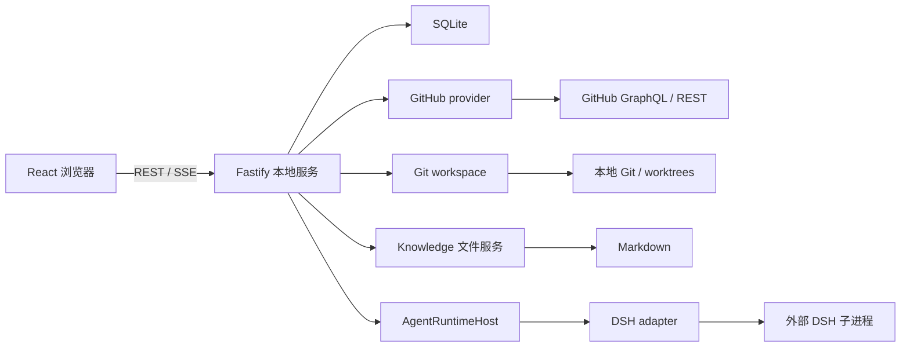

# 架构与代码地图

## 运行结构

[根 package.json](../package.json) 定义 pnpm workspace 和检查入口。前端使用 React 19、React Router 7、TanStack Query 5、Vite 7、Monaco、react-markdown/remark-gfm 和 Mermaid。服务端使用 Fastify 5、Zod 3、YAML；数据层使用 better-sqlite3 和 Drizzle。具体版本以各 package.json、pnpm-lock.yaml 和 dsh.lock.json 为准。

## 目录职责

| 目录 | 负责什么 | 主要入口 |
| --- | --- | --- |
| apps/web | 页面、交互、API 客户端、编辑器 | [AppShell](../apps/web/src/shell/AppShell.tsx) |
| apps/server | 配置、依赖组装、HTTP 和跨模块协调 | [runtime.ts](../apps/server/src/runtime.ts)、[app.ts](../apps/server/src/app.ts) |
| packages/contracts | Zod 请求/响应及产品事件 | [导出](../packages/contracts/src/index.ts) |
| packages/database | SQL、schema、迁移、类型化持久化服务 | [导出](../packages/database/src/index.ts) |
| packages/github | GitHub HTTP、凭证解析、外部响应校验 | [provider.ts](../packages/github/src/provider.ts) |
| packages/git-workspace | Git 命令、diff、worktree 池、checkpoint | [导出](../packages/git-workspace/src/index.ts) |
| packages/agent-runtime | 产品运行时接口及会话 runtime host | [index.ts](../packages/agent-runtime/src/index.ts) |
| packages/agent-runtime-dsh | 固定 DSH SDK、子进程、事件转换 | [index.ts](../packages/agent-runtime-dsh/src/index.ts) |
| packages/knowledge | Markdown 扫描、身份、原子文件写入 | [index.ts](../packages/knowledge/src/index.ts) |
| packages/scheduler | 纯 cron 解析与下一次执行时间计算 | [cron.ts](../packages/scheduler/src/cron.ts) |
| scripts / tests/regression | 架构门禁、测试运行器、关键回归 | [测试说明](testing.md) |

## 启动与关闭

[start.ts](../apps/server/src/start.ts) 调用 `createServerRuntime` 再监听端口。运行时先加载和校验配置，打开数据库并迁移，投影配置中的仓库，恢复中断的 Agent 与元数据同步状态，然后组装同步、分类、Agent、Knowledge、Settings、Scheduler 和 HTTP 路由。Knowledge/Domain watcher 与调度 timer 随运行时启动；导入 app factory 本身不监听端口。

聊天和调度器注入同一个 `WorkspaceRunCoordinator`。SIGINT/SIGTERM 经 [lifecycle.ts](../apps/server/src/lifecycle.ts) 触发幂等关闭；app 的关闭钩子按顺序等待同步、重分类、Agent、Knowledge、Scheduler，最后关闭 SQLite。增加后台服务时必须同时接入退出清理。

## 必须保持的边界

- Web/Server 共享 contracts，禁止复制 HTTP schema。
- 只有 agent-runtime-dsh 可以导入 `@deepseek-ai/*`；产品层消费自身事件。
- 只有 github 包执行 `gh`；当前 GitHub 数据传输使用 HTTP fetch。
- Git 命令在 git-workspace；Knowledge 的 checkpoint 也由该包执行。
- 原始 SQL 全部在 database；Server 编排类型化服务。
- PR/Issue **列表**只读 SQLite。Issue **详情**可按缓存版本触发 provider 刷新。
- `pull_requests` 保存当前已知 PR 事实。Recently Updated 使用 `(updated_at, number)` cursor，PR Number 使用 number cursor；Merged 直接投影 `merged_at IS NOT NULL` 并使用 `(merged_at, number)` cursor。三者都不在 Web 中做全量排序。
- Merged 没有独立表、同步类型或 GitHub crawler；Web 只对单个扁平分页结果按配置时区生成日期分割线。
- `forward` 只推进 forward metadata watermark；`history` 独立维护 cursor、recovery anchor、目标日期和最老覆盖边界；`fetch_pr` 只处理目标 PR，不改变另外两者的状态。History 只补 metadata，不重建逐日状态，也不阻塞在整批历史 changed-files enrichment 上。
- 数据库启动恢复 queued/running metadata/history run；同仓库持久化 running history 会阻止重复 admission，已启用但未达到目标的 bounded history 会以新 run 从持久 cursor 继续。
- Domain 分类仅使用变更路径和规则，不调用模型。
- 同一个 workspace path 同时只运行一个 Agent turn；slot 不代替会话持久化。

[check-architecture.mjs](../scripts/check-architecture.mjs) 是依赖门禁的实现。外部输入在配置、HTTP、provider、DSH 通知和数据库约束处校验；内部类型化模块不重复校验，不把命令失败转为空数据。

## 修改定位

| 需求 | 从哪里开始 | 联动检查 |
| --- | --- | --- |
| 新增 API 字段 | contracts 对应文件 | Server 返回、Web client、契约 UT |
| 调整表/索引 | database schema 和 migrations | typed service、迁移 UT、读写调用方 |
| 同步或分类异常 | sync-coordinator / enrichment-service / domain-classifier | provider、水位、classification-service |
| PR 文件/布局 | diff.ts / pull-request-detail.tsx | git-workspace、文件缓存、Monaco |
| Agent 流式/停止 | agent-chat.ts / agent-runtime-dsh | host、消息持久化、SSE、互斥 |
| Knowledge 保存/历史 | knowledge.ts controller | knowledge 包、knowledge-service、编辑器 |
| 定时任务 | server scheduler.ts | cron 包、scheduler-service、共享互斥 |
| Settings 与凭证 | server settings.ts / web SettingsControlCenter.tsx | contracts、github credentials、Scheduler |
| Domain 源文件与版本 | server domain-file.ts / domains.ts | JSON 源文件、数据库投影、外部修改 watcher |

具体流程分述于本目录模块章节。阶段名称残留在少量代码符号或注释中，不代表功能尚未实现。
