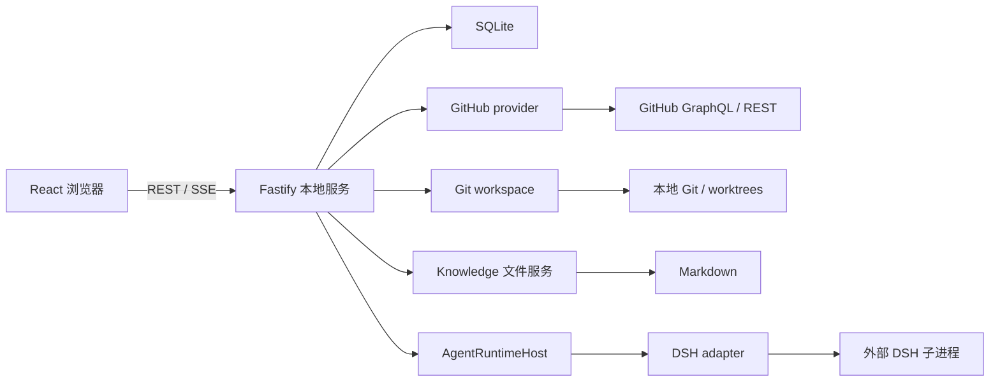

# 架构与代码地图

## 运行结构

LoongBoard 是 local-first 的单实例、单用户应用：一个本地 Fastify 进程拥有 SQLite、Scheduler、同步协调和 Agent runtime host；浏览器只访问该进程的 REST/SSE。它不是多用户控制面，也不依赖分布式队列或跨实例锁。

[根 package.json](../package.json) 定义 pnpm workspace 和检查入口。前端使用 React 19、React Router 7、TanStack Query 5、Vite 7、Monaco、react-markdown/remark-gfm 和 Mermaid。服务端使用 Fastify 5、Zod 3、YAML；数据层使用 better-sqlite3、顺序迁移和按业务拆分的类型化 SQLite service。具体版本以各 package.json、pnpm-lock.yaml 和 dsh.lock.json 为准。

## 目录职责

| 目录 | 负责什么 | 主要入口 |
| --- | --- | --- |
| apps/web | 页面、交互、API 客户端、编辑器 | [AppShell](../apps/web/src/shell/AppShell.tsx) |
| apps/server | 配置、依赖组装、HTTP 和跨模块协调 | [runtime.ts](../apps/server/src/runtime.ts)、[runtime-settings-adapters.ts](../apps/server/src/runtime-settings-adapters.ts)、[app.ts](../apps/server/src/app.ts)、[routes/](../apps/server/src/routes) |
| packages/contracts | Zod 请求/响应及产品事件 | [导出](../packages/contracts/src/index.ts) |
| packages/database | SQL、schema、迁移、类型化持久化服务 | [导出](../packages/database/src/index.ts) |
| packages/github | GitHub HTTP、凭证解析、外部响应校验 | [provider.ts](../packages/github/src/provider.ts) |
| packages/git-workspace | Git 命令、diff、worktree 池、checkpoint | [导出](../packages/git-workspace/src/index.ts) |
| packages/agent-runtime | 产品运行时接口及会话 runtime host | [index.ts](../packages/agent-runtime/src/index.ts) |
| packages/agent-runtime-dsh | 固定 DSH SDK、子进程、事件转换 | [index.ts](../packages/agent-runtime-dsh/src/index.ts) |
| packages/knowledge | Markdown 扫描、身份、原子文件写入 | [index.ts](../packages/knowledge/src/index.ts) |
| packages/scheduler | 五字段 cron 校验与下一次执行时间计算包装层 | [cron.ts](../packages/scheduler/src/cron.ts) |
| scripts / tests/regression | 架构门禁、测试运行器、关键回归 | [测试说明](testing.md) |

## 启动与关闭

[start.ts](../apps/server/src/start.ts) 调用 `createServerRuntime` 再监听端口。运行时先加载和校验配置，打开数据库并迁移，投影配置中的仓库，恢复中断的 Agent 与元数据同步状态，然后按同步、分类、Agent、Knowledge、Settings、Scheduler 和 HTTP 路由的边界组装服务。`runtime.ts` 只负责加载配置、打开/恢复数据库、构造依赖、接线、启动和关闭；Settings、backup、worktree 与 Agent 的适配桥及运行时投影集中在 [runtime-settings-adapters.ts](../apps/server/src/runtime-settings-adapters.ts)，系统 action 和 schedule projection 分别归属 [system-actions.ts](../apps/server/src/system-actions.ts) 与 [system-schedules.ts](../apps/server/src/system-schedules.ts)。Settings policy 会在 `scheduler.start` 前经 [system-schedules.ts](../apps/server/src/system-schedules.ts) 投影到稳定的 system task；Settings 更新也经过同一 projector 刷新任务。Knowledge/Domain watcher 与调度 timer 随运行时启动；导入 app factory 本身不监听端口。

生产流程先由根脚本执行 `pnpm build`，再由 `pnpm start` 使用 `node --conditions=production apps/server/dist/start.js` 启动。workspace package 的 `production` export 指向各自 `dist/index.js`，开发和测试仍通过 `types`/`import` 使用 `src`。编译后的 start 入口按自身位置解析 `apps/web/dist`，因此不依赖当前工作目录。只有 production start 传入 static root 时，Fastify 才注册静态文件和 React deep-link fallback；`/api/*` 未匹配路由保持 JSON 404。

代码和运行数据分离：代码、构建产物及依赖属于应用仓库或镜像；SQLite、Agent session、Knowledge、worktrees、Settings 和凭证路径由 `system.yaml` 指定。YAML 相对路径相对配置文件目录解析。Docker 将宿主机 data root 挂载为 `/data`，并通过 `LOONGBOARD_SERVER_HOST`/`LOONGBOARD_SERVER_PORT` 覆盖容器监听地址/端口，不改变这些数据路径。

聊天和调度器注入同一个 `WorkspaceRunCoordinator`。Repository metadata 的 admission 还由 [sync-coordinator.ts](../apps/server/src/sync-coordinator.ts) 统一协调：同一仓库的 foreground sync / `fetch_pr` 优先于 History；metadata maintenance 以 batch 为边界让出 admission，不能在长批处理中饿死前台请求。后台 worker 不应另建一套 repository lock。

HTTP 生产入口是 [buildProductionApp](../apps/server/src/app.ts)，要求注入完整的产品 capability，包括 GitHub、Agent、Knowledge、Settings、metadata maintenance、Scheduler 和真实 `LocalGitWorkspace`；Server package 的 [index.ts](../apps/server/src/index.ts) 只公开这个生产入口。同仓库 focused tests 直接从 `src/app` 导入单独的 `buildTestApp` lightweight builder，其中的 optional capability 和 fallback 只属于测试 builder，不构成第二套生产组装路径。旧的 `buildApp` 入口已删除。`app.ts` 只保留 Fastify composition、health/parser、auth guard、统一 error handler、静态站点接入和 route composition；repositories、sync、metadata、auth 的 HTTP route 分别位于 `apps/server/src/routes/` 对应文件，保持直接调用现有 service 的轻量边界。

SIGINT/SIGTERM 经 [lifecycle.ts](../apps/server/src/lifecycle.ts) 触发幂等关闭；app 的关闭钩子先停止 metadata maintenance，再等待 `SchedulerEngine` 停止 timer 并结束活跃的 scheduled Agent runs，然后关闭 Agent runtime，之后才关闭同步协调、Knowledge、Domain watcher、重分类和 SQLite。增加后台服务时必须同时接入退出清理。

Scheduler 是现有唯一的定时入口。`SchedulerEngine` 为持久任务维护 timer map，并把九个 canonical system action 委派给 [system-actions.ts](../apps/server/src/system-actions.ts) 的统一 registry；`runtime.ts` 不再拥有这些 action 的实现。Settings V2 是 system schedule policy authority；runtime 启动和 Settings 更新都会经 [system-schedules.ts](../apps/server/src/system-schedules.ts) 把 policy 投影到稳定的 `scheduled_tasks` 行，Scheduler 只执行 projection 并记录 runtime facts。metadata maintenance 使用现有 `repository.metadata-maintenance` system action（默认每天 03:00，按配置时区）。该 action 每天执行固定的 runtime sync-run history purge；只有 Repository retention 的 automatic archive 开关打开时才追加 metadata archive/prune，不会添加第二个 timer、后台 cron 或独立调度框架。

## 必须保持的边界

- Web/Server 共享 contracts，禁止复制 HTTP schema。
- `buildProductionApp` 的生产依赖完整且必选，且是 Server package 的唯一公开 app builder；`buildTestApp` 仅供同仓库 focused tests 从 `src/app` 直接导入，不能在生产 runtime 中按 capability 是否存在选择分支。
- `SyncCoordinator` 的产品操作 `startHistory`、`startFetchPullRequest`、`configureHistory`、`pauseHistory`、`resumeHistory` 均为必选接口；生产 route 直接调用，不以 `undefined` 防御替代产品能力。
- `settings.json` V2 保存用户 policy；`scheduled_tasks` 是 system schedule projection，`scheduled_task_runs` 是 runtime history，runtime facts 不反向写 Settings。
- Settings API 返回的 Code backup `repositoryPath` 和 `available` 只来自 runtime；它们不是可持久化的用户 policy。
- 只有 agent-runtime-dsh 可以导入 `@deepseek-ai/*`；产品层消费自身事件。
- 只有 github 包执行 `gh`；当前 GitHub 数据传输使用 HTTP fetch。
- Git 命令在 git-workspace；Knowledge 的 checkpoint 也由该包执行。
- 原始 SQL 全部在 database；Server 编排类型化服务。
- PR/Issue **列表**只读 SQLite。Issue **详情**可按缓存版本触发 provider 刷新。
- `pull_requests` 保存当前已知 PR 事实。Recently Updated/Number 两种 PR 列表和 Merged 列表均使用 `page` + `limit` 的 OFFSET 分页；只有 Issue 列表使用 `(updatedAt, number)` cursor。三者都不在 Web 中做全量排序。
- Merged 没有独立表、同步类型或 GitHub crawler；Web 只对单个扁平分页结果按配置时区生成日期分割线。
- `forward` 只推进 forward metadata watermark；`history` 独立维护 cursor、recovery anchor、目标日期和最老覆盖边界；`fetch_pr` 只处理目标 PR，不改变另外两者的状态。History 只补 metadata，不重建逐日状态，也不阻塞在整批历史 changed-files enrichment 上。
- 数据库启动恢复 queued/running metadata/history run；同仓库持久化 running history 会阻止重复 admission，已启用但未达到目标的 bounded history 会以新 run 从持久 cursor 继续。
- History 的 rate-limit floor 会把 GitHub `resetAt` 投影为持久 `resume_after`，到安全时间前不重新 admission；foreground 请求不会被该低优先级等待阻塞。
- metadata maintenance 只在 archive transaction/batch 边界释放 repository admission；它不能删除 active metadata，恢复或 metadata refresh 会清除相应 archive/pruned 标记。
- Domain 分类仅使用变更路径和规则，不调用模型。
- 同一个 workspace path 同时只运行一个 Agent turn；slot 不代替会话持久化。

## 代码、运行数据和安全边界

应用代码、`dist` 和依赖属于 checkout 或镜像；`system.yaml`、`settings.json`、SQLite、Knowledge Markdown/Git、Agent session homes、凭证、Domain 文件和可选 Agent Archive 是运行数据，位置由配置和 data root 决定。Agent Archive 默认位于 `systemRoot/agent-history`，用户明确保存的自定义 `archiveRepositoryPath` 优先；Docker 的默认路径因此是 `/data/agent-history`。Code backup 的 `repositoryPath` 与 `available` 是运行时事实，不写入 SettingsDocumentV2；`repositoryPath` 由真实 code checkout 决定。Worktree 是可重建缓存，但 dirty 或未提交用户内容仍需保护。

可选密码锁只保护 LoongBoard Web/API 的访问门禁。它把 scrypt 派生值和 HMAC 签名密钥写入 `runtime.statePath/auth.json`，以 HttpOnly、SameSite=Strict cookie 建立本地会话；它不加密 SQLite、Knowledge、Agent home、worktree 或任何其他运行数据。DSH 仍是外部 runtime，产品只保存 opaque runtime id 和 normalized 消息，不复制 DSH loop 或 title generation；会话标题只读取 DSH 原生 title 能力并投影 ownership，不由 LoongBoard 另行生成。

[check-architecture.mjs](../scripts/check-architecture.mjs) 是依赖门禁的实现。外部输入在配置、HTTP、provider、DSH 通知和数据库约束处校验；内部类型化模块不重复校验，不把命令失败转为空数据。

## 修改定位

| 需求 | 从哪里开始 | 联动检查 |
| --- | --- | --- |
| 新增 API 字段 | contracts 对应文件 | Server 返回、Web client、契约 UT |
| 调整表/索引 | database migrations | typed service、迁移 UT、读写调用方 |
| 同步或分类异常 | sync-coordinator / enrichment-service / domain-classifier | provider、水位、classification-service |
| PR 文件/布局 | diff.ts / pull-request-detail.tsx | git-workspace、文件缓存、Monaco |
| Agent 流式/停止 | agent-chat.ts / agent-runtime-dsh | host、消息持久化、SSE、互斥 |
| Knowledge 保存/历史 | knowledge.ts controller | knowledge 包、knowledge-service、编辑器 |
| 定时任务 | server scheduler.ts | cron 包、scheduler-service、共享互斥 |
| Settings 与凭证 | server settings.ts / web SettingsControlCenter.tsx | contracts、github credentials、Scheduler |
| Domain 源文件与版本 | server domain-file.ts / domains.ts | JSON 源文件、数据库投影、外部修改 watcher |

具体流程分述于本目录模块章节。阶段名称残留在少量代码符号或注释中，不代表功能尚未实现。
